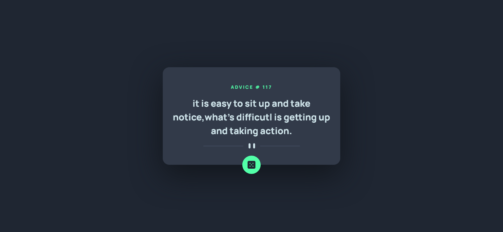

# Advice generator app

The perfect project if you're learning how to interact with 3rd-party APIs. 
This challenge uses the Advice Slip API to generate random quotes of advice

## Table of contents

- [Overview](#overview)
  - [Screenshot](#screenshot)
  - [Links](#links)
  - [Useful resources](#useful-resources)

## Overview
- The perfect project if you're learning 
- how to interact with 3rd-party APIs. 
- interact feth() , promises,error handling
- This challenge uses the Advice Slip API to generate random quotes of advice

### The challenge

Users should be able to:

- 

### Screenshot

### Links

- Solution URL: [Solution URL](https://github.com/shawky55/advice-generator/)
- Live Site URL: [Live Site URL](https://shawky55.github.io/advice-generator/)

# useful-resources

- API :[Adivce slip api](https://api.adviceslip.com/)

